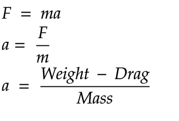

# Recovery mechanism

This is the actual deployment of the recovery mechanism in slowing down the rocket. This also includes opening latches to push out parachutes.

Some examples of the recovery mechanisms are:

1. Parachutes. This is the most effective method of recovery system.
2. Side deployment. The parachute is ejected on the outside of the rocket using some kind of spring mechanism
3. Inline deployment. The parachute is ejected along the axis of the rocket.
4. Streamer. It is deployment same as the parachute.
5. Wings, glider. This is commonly ised as passive control.
6. Changing CG, This involves changing the weight of the rocket in order to shift stability.
7. Changing CP, centre of pressure in order to move air surfaces to change the flight's stability.
8. Balloon. A balloon can be inflated from an internally stored pressure chamber in order to increase the rocket's drag.

For N1 rocket we choose the parachute system. This is too slow the rocket to an acceptable descent rate to ensure survival of the avionics. There is usually a backup system e.g deploying to parachutes or using two different methods.

A parachutre is basically a flexible device whose function is to produce drag. It slows down the rocket to a decent speed.

Dual deploy means there is a primary and secondary parachute to reduce the impact. The first is generally stronger to overcome large velocities and stabilize the rocket. The second one is attached to teh first one via a tow-line and is used to reduce drift away from launch site.

Shock cord, rubber band, is used to as a gravity coupler. This is to store kinetic energy before opening up the parachute.

Main canopy is attached to the towline to provide soft landing

From the diagram above we can clearly see, according to Newton, the addition of more drag (an adverse force) results in a lower acceleration.

Whether the body decelerates (negative acceleration) or not depends on the velocity and altitude of the parachute deployed.

If the body has high velocity at parachute ejection, the drag may be greater than weight.  In this case the body will decelerate. If the body has low velocity at parachute ejection, the drag may be lower than weight.  In this case the body will accelerate.

Velocity changes so as the drag. At equilibrium point the drag is equal to the weight.

If drag starts off lower than weight, acceleration will be positive. This increases velocity and drag. Drag will eventually equal weight and acceleration become zero.

When velocity isn't changing it has reached terminal velocity and it will descend at a constant velocity.

For terminal velocity drag = weight.

The parachute design process needs:

- desired shape
- weight
- drag coefficient
- determine impact velocity
- canopy area

### Desired shape

We will look at three main designs:

1. Cross

    - Easy to build

    - Lower coefficient of drag, (0.70)

    - More stable

2. Square

    - Easiest to build

    - Moderate coefficient of drag, 0.73

    - Less stable

3. Circular

    - Difficult to build

    - Higher coefficient of drag, 0.78

    - The Least stable

### Weight

At terminal velocity, drag should be equal to weight, 9.8067 N

### Drag coefficient

The drag coefficient itself depends on the Reynolds number Re. For small enough Reynolds number (of the order of few thousands or smaller) the dependence is mild and the drag coefficient is approximately constant.

### Determine impact velocity

### Canopy area

Hints:

1. Get atmospheric temperature of where I am testing, [Juja](https://www.accuweather.com/en/ke/juja/828638/hourly-weather-forecast/828638)
2. Calculate the air density of where you are testing, [Juja](https://www.omnicalculator.com/physics/air-density?c=KES&v=P:1013!hPa,Temp:28!C,aaa:1.000000000000000,T:11!C)
3. Check if our area provides the drag equal to weight, [here](https://www.omnicalculator.com/physics?c=USD&v=Cd:0.7,u:2!ms,rho:1.1661!kgm3,A:6.00702!m2)
