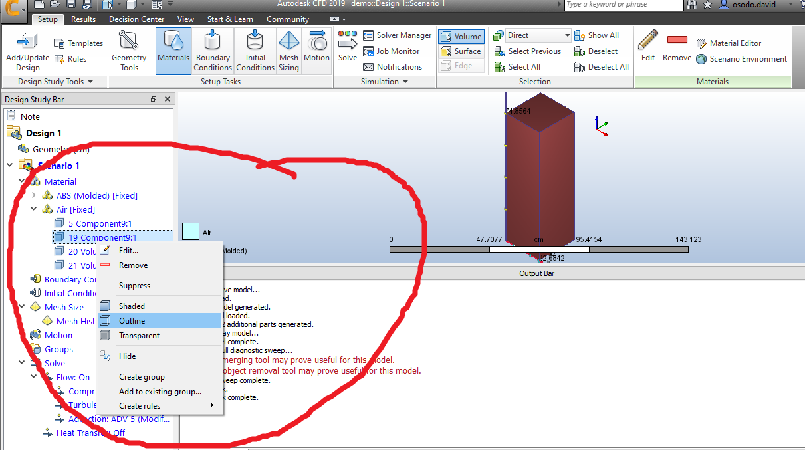

# CFD

Computational fluid dynamics (CFD) is a branch of fluid mechanics that uses numerical analysis and data structures to analyze and solve problems that involve fluid flows.

## Methodology

Some basic procedures during preprocessing are:

- The geometry and physical bounds of the problem are defined using computer aided design (CAD). From there, data is processed and the fluid volume is extracted.
- The volume occupied by the fluid is divided into discrete cells. The volume may be uniform or non-uniform or structured or unstructured.
- Physical modeling is defined, the equations of fluid motion + enthalpy + radiation + species conservation.
- Boundary conditions are defined. This involves specifying the fluid behaviour and properties at all bounding surfaces of the fluid domain. For transient problems, the initial conditions are also defined.
- The simulation is started and the equations are solved iteratively as a steady-state or transient.
- Finally, a postprocessor is used for the analysis and visualization of the resulting solution.

### Definitions

The term **compressible** refers to the relationship between density and pressure. If a flow is compressible, changes in fluid pressure affect its density and vice versa. For compressible flow, particularly supersonic flows, downstream pressure cannot affect anything upstream and the pressure equation is hyperbolic, requiring only upstream boundary conditions.

**Laminar flow** is characterized by smooth, steady fluid motion.

**Turbulent flow** is fluctuating and agitated motion. The measure of whether a flow is laminar or turbulent is the speed of the fluid. Laminar flow is typically much slower than turbulent flow. The dimensionless number which is used to classify a flow as either laminar or turbulent is the Reynolds number defined as:

Where **rho** is the density, **V** is the velocity and **meu** is the viscosity. For Reynolds numbers greater than ~2500, the flow exhibits turbulent flow phenomena. Most engineering flows are turbulent.

The three-dimensional time-dependent continuity, Navier-Stokes and energy equations apply to laminar as well as turbulent flow. However, due to the infinite number of time and length scales inherent in turbulent flows, the solution of these equations require a huge number of finite elements even for a simple geometry as well as nearly infinitesimally small-time-steps. For most practical applications, it is unreasonable to model the flow in this manner.

To circumvent the need for such immense computer resources, the governing pdes are averaged over the scales present. There are several choices of scale types available for averaging. Autodesk Simulation CFD solves the time-averaged governing equations.

The time-averaged equations are obtained by assuming that the dependent variables can be represented as a superposition of a mean value and a fluctuating value, where the fluctuation is about the mean. For example, the x-velocity component can be written as:

Where **U** is the mean velocity and **u'** is the fluctuation about that mean. This representation is substituted into the governing equations and the equations themselves are averaged over time.

#### Continuity Equation

**Wind tunnels** are large tubes with air blowing through them which are used to replicate the interaction between air and an object flying through the air or moving along the ground. Researchers use wind tunnels to learn more about how an aircraft will fly. The wind tunnel moves air around an object, making it seem as if the object is flying.

### Pressure measurements

Pressure across the surfaces of the model can be measured if the model includes pressure taps. This can be useful for pressure-dominated phenomena, but this only accounts for normal forces on the body.

### Flow visualizations

Because air is transparent it is difficult to directly observe the air movement itself. Instead, multiple methods of both quantitative and qualitative flow visualization methods have been developed for testing in a wind tunnel.

### Physics of fluid

Fluid is liquid and gas. For example, water and air. Fluid has many important properties, such as velocity, pressure, temperature, density and viscosity.
The density (1) of a fluid is its mass per unit volume. If the density of fluid is constant (or the change is very small), we call the fluid is incompressible fluid. If the density of fluid is not constant, we call the fluid is compressible fluid. Normally, we can treat water and air as incompressible fluid. If the fluid is incompressible, we can simplify the equations for this type of fluid.

The viscosity (2) is an internal property of a fluid that offers resistance to flow. For example, to stir water is much easier than to stir honey because the viscosity of water is much smaller than honey

## The Process

### First open up Fusion 360

Load the assembly model

Create a wind tunnel around the model 

Pad the model with spacing of your choice, 50mm all around

The wind tunnel is now created

Export the file as `.step` or `.stp` file

Open up Autodesk cfd/CFD

Open your `.step` or `.stp` file in CFD

Select the parts of your model

Edit the parts of the model to be solid and set them to the material of your choice

Select the components of the wind tunnel and edit them as Fluid of type air

Make the wind tunnel as outline instead of solid

Head over to the bouddaries tab and click it

Select the rectandle at the top of the nose cone

Edit is as:

- type = velocity
- unit = m/s
- time = steady state
- method = normal
- Diecrion = reverse normal
- Spatial variations = constant
- velocity magnitude = 30

Select the rectangle as the base of the tail and edit it as:

- type = pressure
- unit = pa
- time = steady state
- pressure = 0
- Gage / Absolute = gage
- Static / Total = static

Click on the solve tab and solve

## Results

The results validated our initial hypothesis that parabolic nose cone reduce the pressure impacted on the nose and also trapezoidal fins reduce the pressure on the sides of the fins of the nose cone

