# 3D prinitng basics on `ULTIMAKER s3`

## Theory

This is from the ultimaker site.

### Layer height

It is the thickness of one printed layer in millimeters.
Thinner layer height increases the quality of the print, leading to a smoother surface and more detail model.

### Initial layer height

This is the height of the first layer of your print. The initial layer height is usually thicker than the layer height to create a stronger adhesion with the build plate.

### Line width

The width of a single printed line, which should be close to the nozzle size.

- Top surface skin line width: This line width is only available when a top surface skin is used.
- Top/bottom line width: The line width with which the top and bottom layers are printed.
- Infill line width: The line width of all infill material.

### Infill density

It is the amount of plastic used on the inside of the print. A higher infill density means that there is more plastic on the inside of your print, leading to a stronger object.

### Infill pattern

This is the pattern of the infill material.

- Strong 2D infills are used for everyday prints
- Quick 2D infills are used for quick, but weak models
- 3D infills are used to make the object equally strong in all directions
- 3D concentric infills are used for flexible materials

The following pattern options are available:

- Grid: Strong 2D infill
- Lines: Quick 2D infill
- Triangles: Strong 2D infill
- Tri-hexagon: Strong 2D infill
- Cubic: Strong 3D infill
- Cubic (subdivision): Strong 3D infill (this saves material compared to Cubic)
- Octet: Strong 3D infill
- Quarter cubic: Strong 3D infill
- Concentric: Flexible 3D infill
- Zig-zag: A grid shaped infill, printing continuously in one diagonal direction
- Cross: Flexible 3D infill
- Cross 3D: Flexible 3D infill
- Gyroid infill: Infill with increased strength for the lowest weight.

### Printing temperature

The temperature of the nozzle while printing, including the adapted extrusion rate. Each printing profile has a slightly different printing temperature to create the best print result.

### Build plate temperature

The heated bed temperature during the printing process. Each material has an ideal build plate temperature, which is set here.

### Print speed

The print speed defines the speed (in mm/s) at which the print head moves while printing. Based on this setting, Ultimaker Cura calculates the extrusion flow.

A higher print speed will lead to a shorter print time. Keep in mind that increasing the print speed means that you may have to increase the temperature as well to ensure the filament is properly melted.

### Enable cooling fans

With this setting you can enable or disable the print head fans during printing. The print head fans ensure that the material is cooled properly before the next layer is printed. For layers with a short layer time, and those with bridges/overhangs, cooling will increase the print quality.

### Fan speed

When the print head fans are enabled, you can adjust certain parameters. One of these is the fan speed – the speed at which the fans spin. A higher speed allows for better cooling and reduces oozing, but can also increase the shrinkage of the material.

### Build plate adhesion

#### Raft

A raft adds a thick grid with a roof between the model and the build plate. This can be useful when the bottom surface of a model is not completely flat or has little adhesion to the build plate. A raft ensures that the model will stick better to the build plate.

#### Brim

Brim adds a single layer flat area around the base of the model to prevent warping. The brim is connected to the model and makes the bottom surface area bigger. This increases the adhesion to the build plate and, in case of warping, the corners of the model are less likely to curl up because of the brim attached to it.

## Process

### 1. Open your model to import it inside ultimaker cura software

[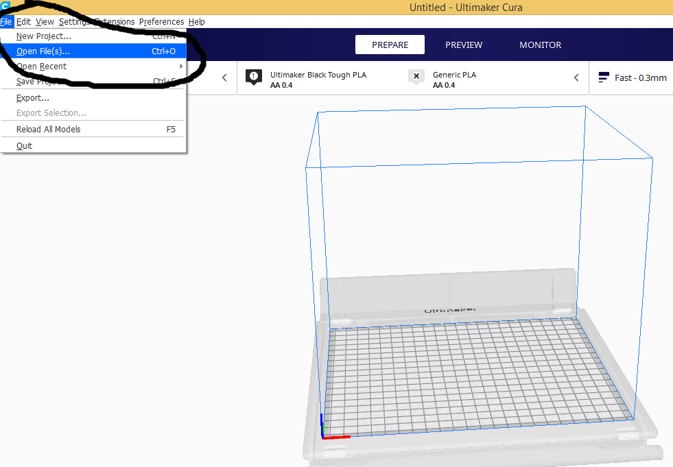](img/3Dprinting/p1.png)

### 2. The model has been imported with the orientation in which you drew it

[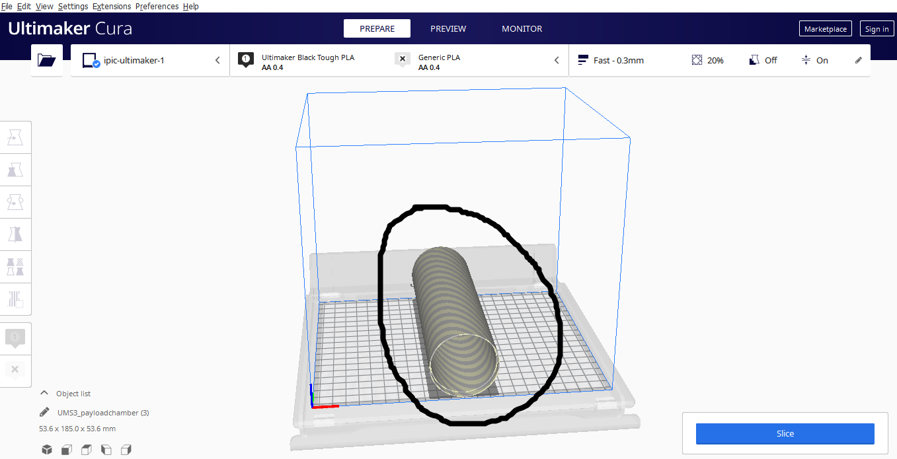](img/3Dprinting/p2.png)

### 3. Change the orientation so that it lies vertically

[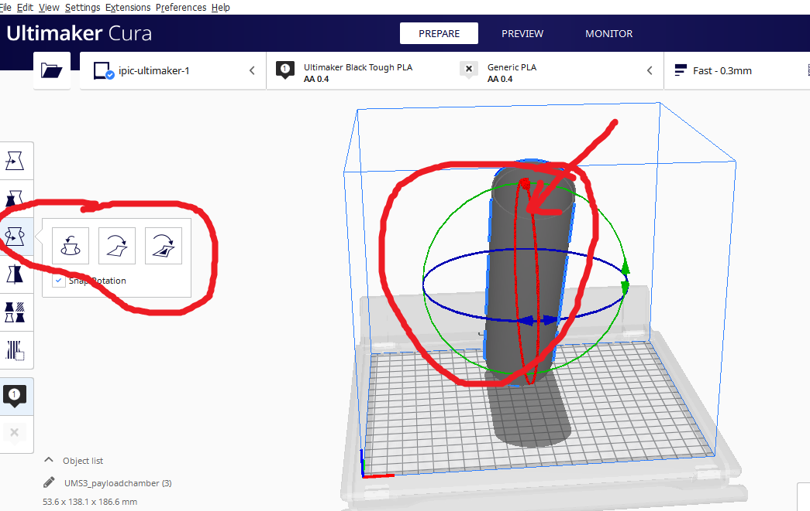](img/3Dprinting/p3.png)

### 4. Click on the lay flat so that it can automatically set the base to the bed

[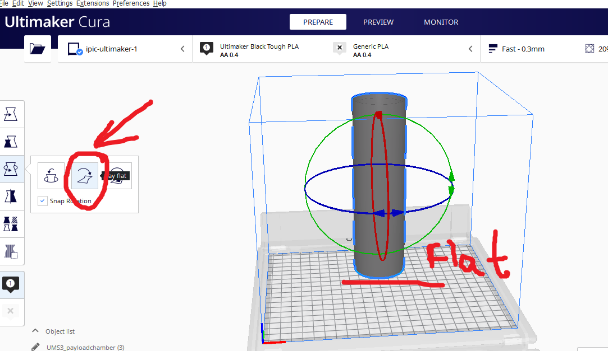](img/3Dprinting/p4.png)

### 5. Center the model on the bed

[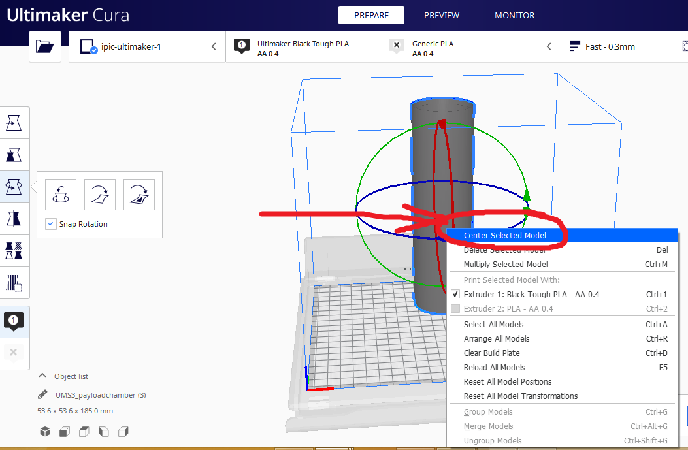](img/3Dprinting/p5.png)

### 6. You can scale down the model with the height alone. Click to remove uniform scaling in order to scal e the height alone

[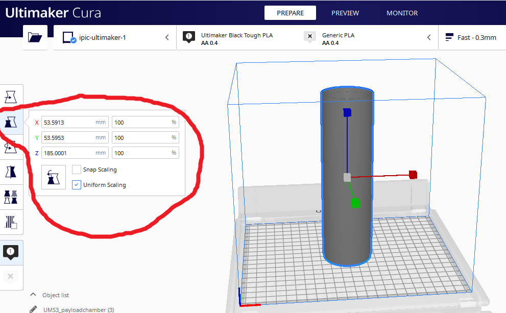](img/3Dprinting/p6.png)

### 7. The model has been scaled down in terms of height

[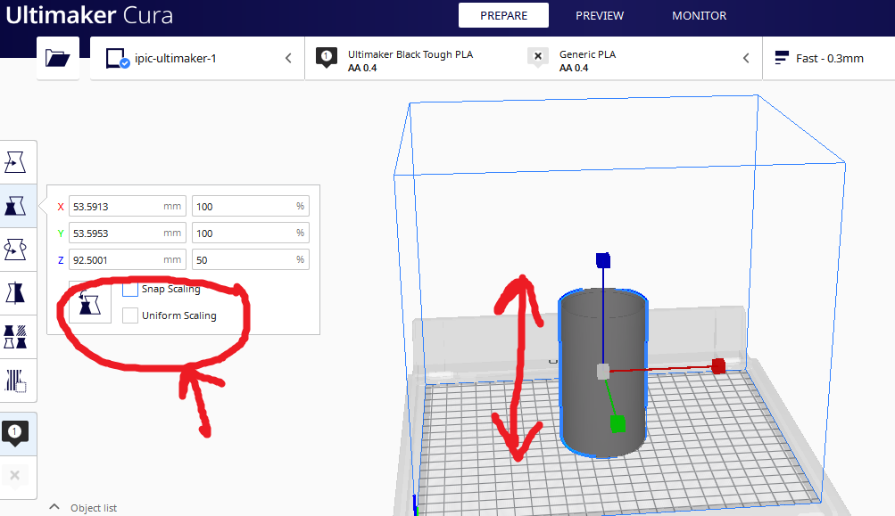](img/3Dprinting/p7.png)

### 8. Click on the top right conrer in order to change the print settings

[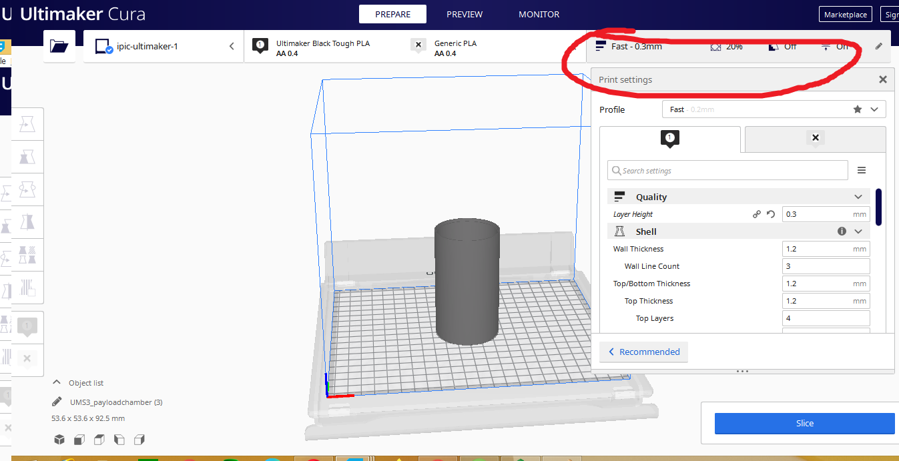](img/3Dprinting/p8.png)

### 9. Change it to normal

[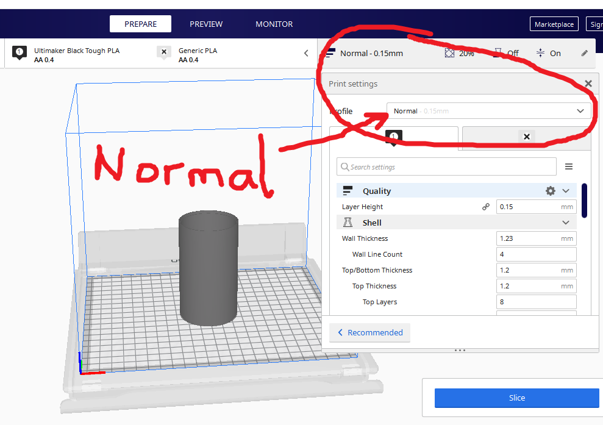](img/3Dprinting/p9.png)

### 10. Change the layer height to 0.2mm

[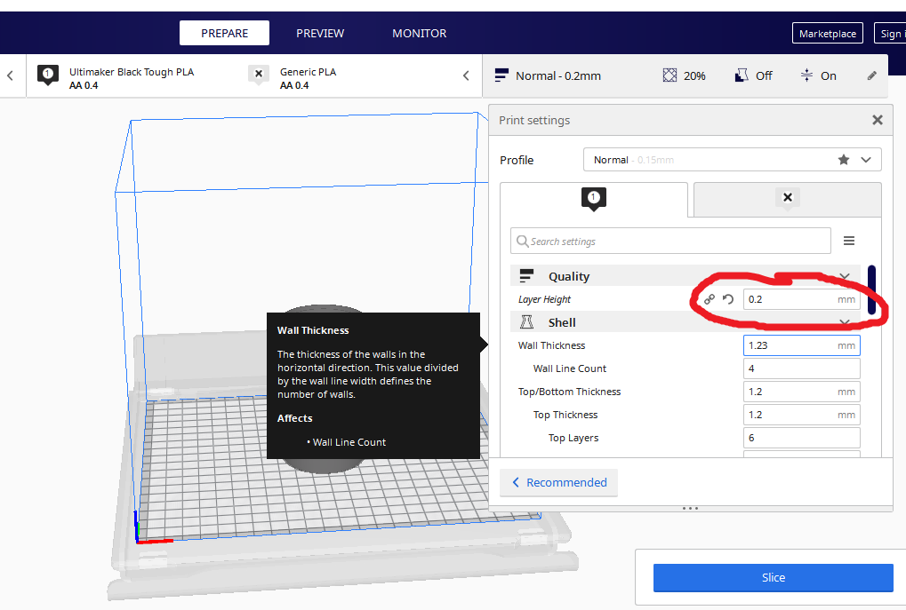](img/3Dprinting/p10.png)

### 11. Maintain the top and bottom thickness to 1.2mm with 6 layers

[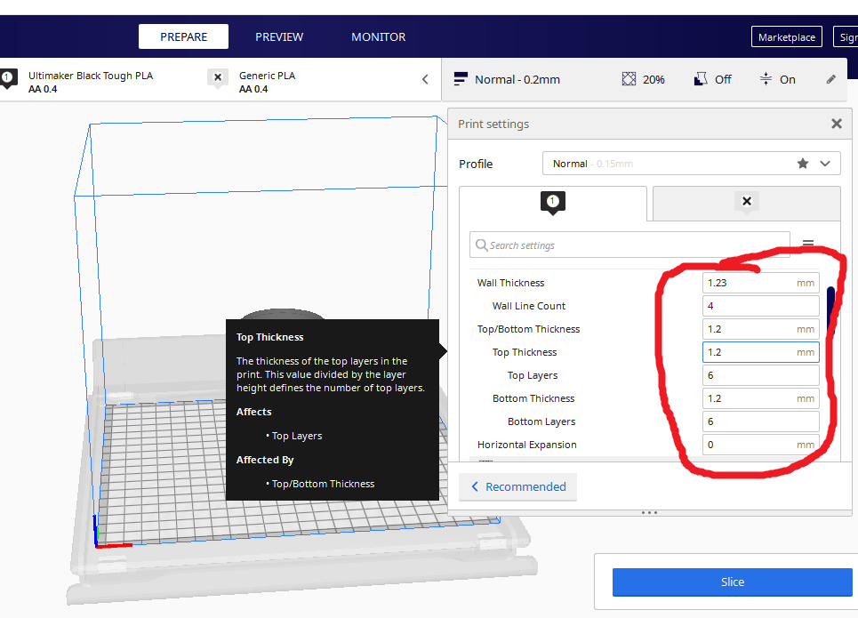](img/3Dprinting/p11.png)

### 12. Change the infill pattern to `Lines` also the temperature set the printing temperature to `223 C` and build plate temperature to `70 C`

[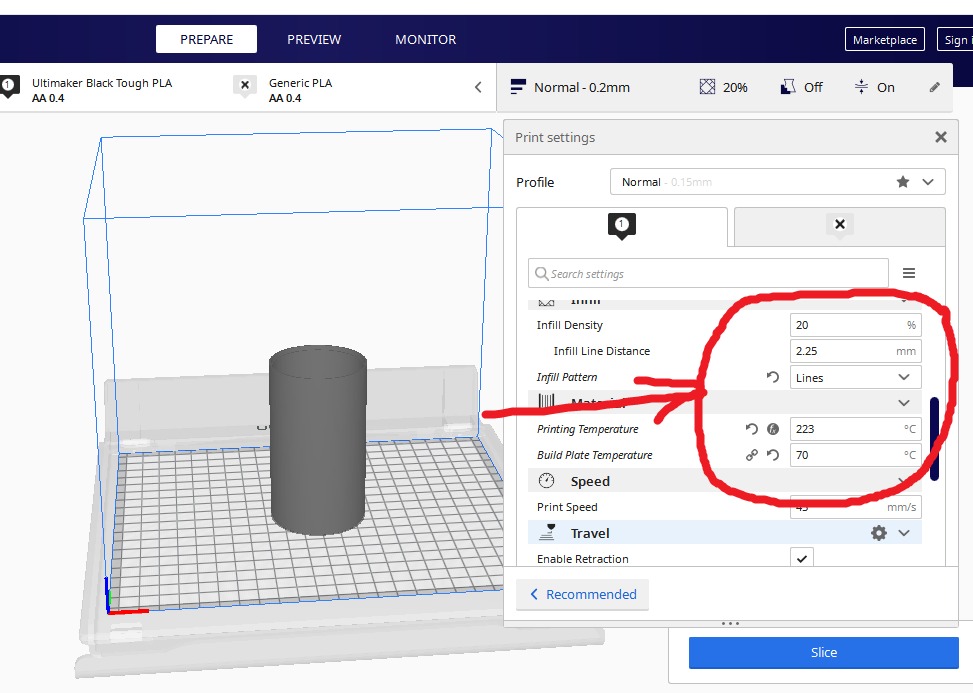](img/3Dprinting/p12.png)

### 13. Enable print cooling at 100%

[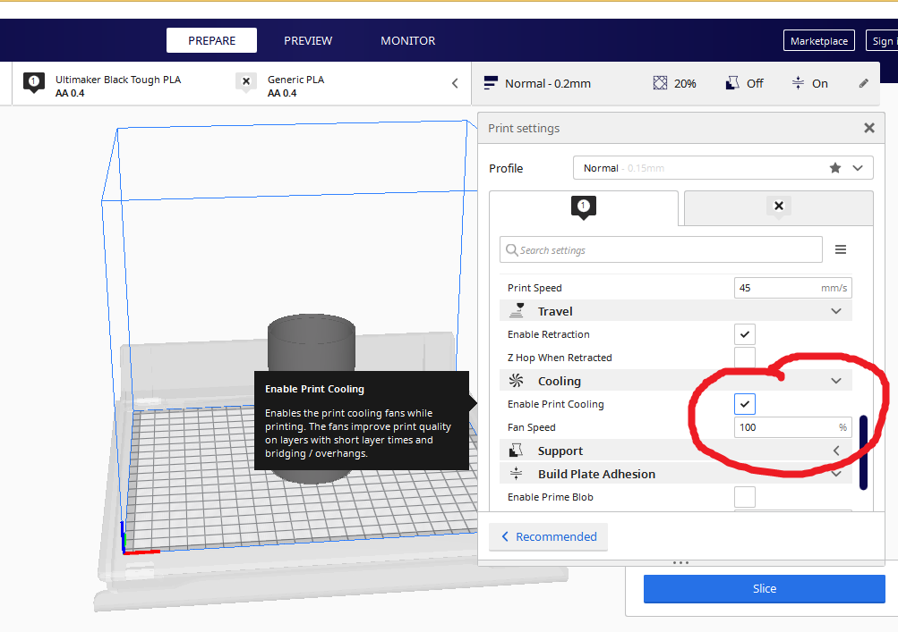](img/3Dprinting/p13.png)

### 14. Change the build plate adhesion type to `Raft` with a margin of `5mm`

[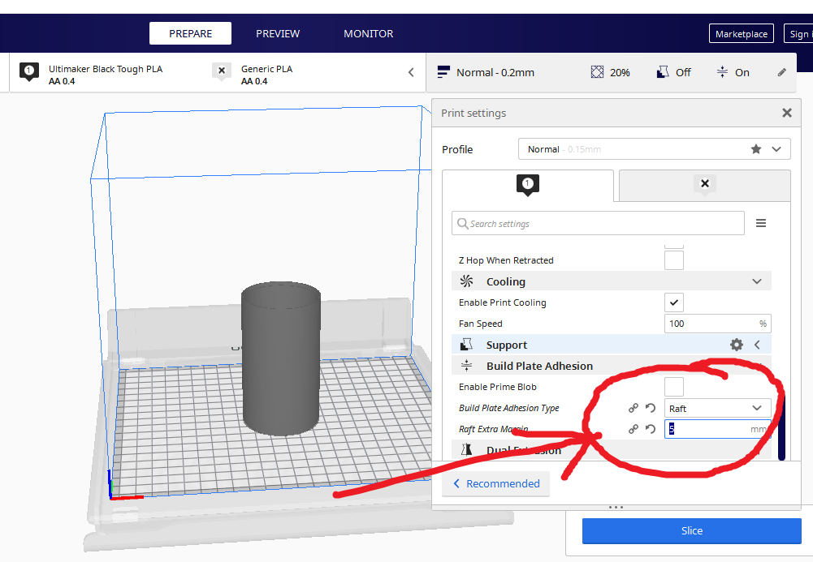](img/3Dprinting/p14.png)

### 16. Click on the machine you want to print. This is for machines connected in the network and print

[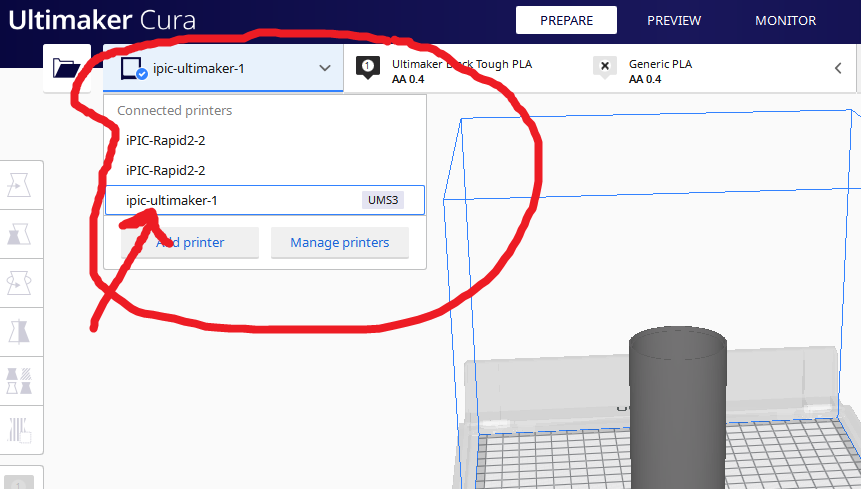](img/3Dprinting/p16.png)

### 17. Monitor the prinitng process using a camera

[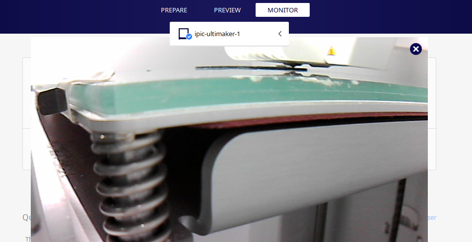](img/3Dprinting/p17.png)

### 18. Monitor tab where you can find the progess

[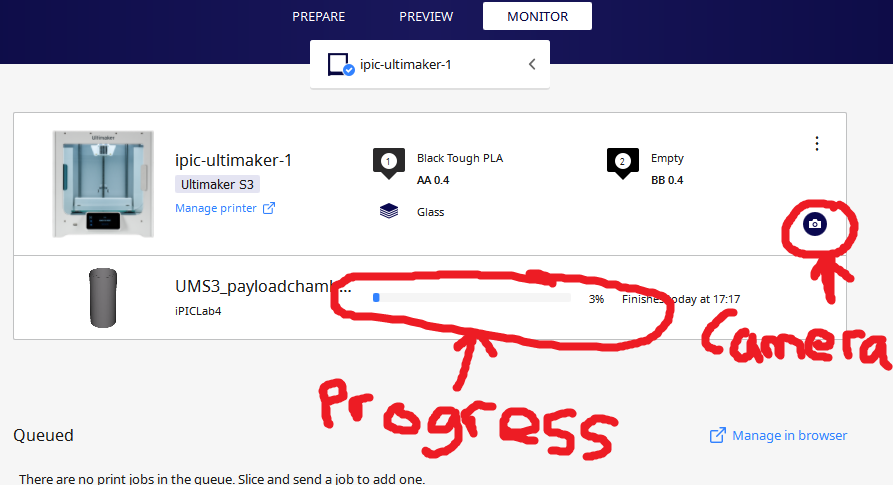](img/3Dprinting/p18.png)
