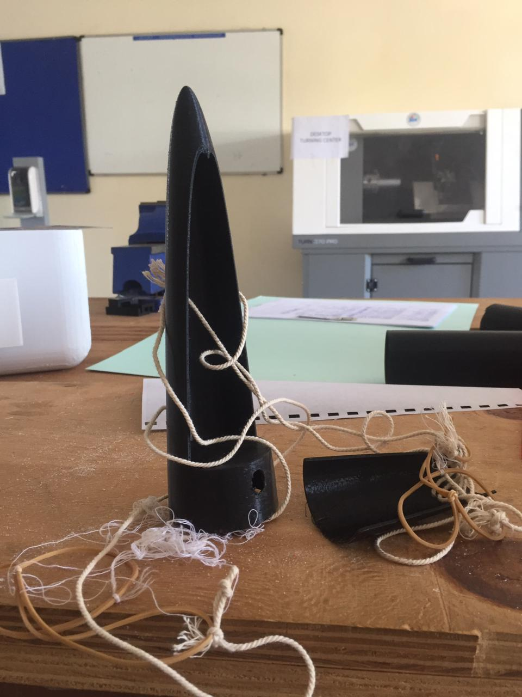
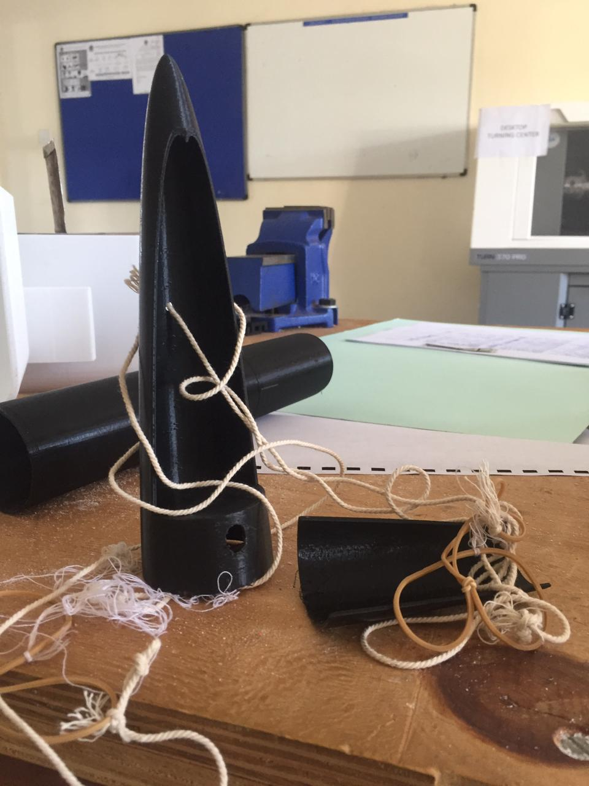

# Version 1.1

## Introduction

This was pur first nose cone design for the rocket. We didn't have any prior know how on how the parachute ejection mechanism would work. The design files can be found [here](https://github.com/nakujaproject/airframev1/blob/e236fa8ae708f634feae82047ced389b07deac66/Design/nose-basepart1.stl)

### Some images

## Problem

The parachute was not able to open up since the walls of the base part of the nose cone constrained it from ejecting.

## Modifications

We tried and make the opposite. So that the base part that joins with the rocket has less material while the cover covers all of it.
