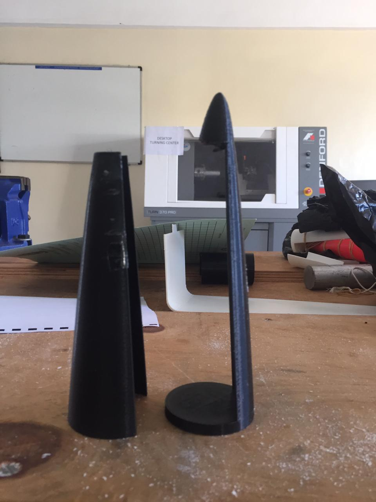
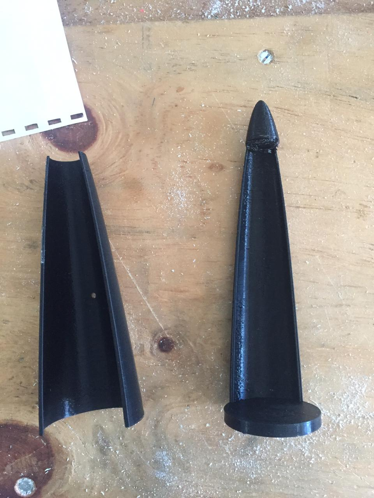
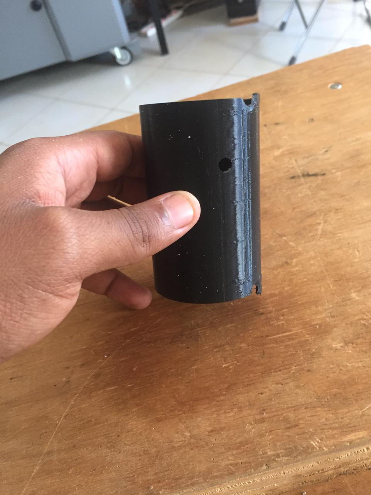

# Version 2

## Introduction

This was our second nose cone design for the rocket. We tried and make the opposite. So that the base part that joins with the rocket has less material while the cover covers all of it. The servo mechanism remained the same to be able to hold the cover before opening it up. The design can be found [here](https://github.com/nakujaproject/airframev1/tree/cf36e4de9e948d365fbf606aeacae3a5e0503ae5)

### Some images

## Problem

The servo arm was able to release the cover of the nose cone outside but the parachute still had trouble in deploying. Parachute was holding on to the cover this time instead of releasing.

## Modifications

We tried and made the cover to have 60% and the base have 40% of the total material coverage so that the parachute could have and easier time releasing. We also added the servo mechanism inside, so that it could push out the top part.
