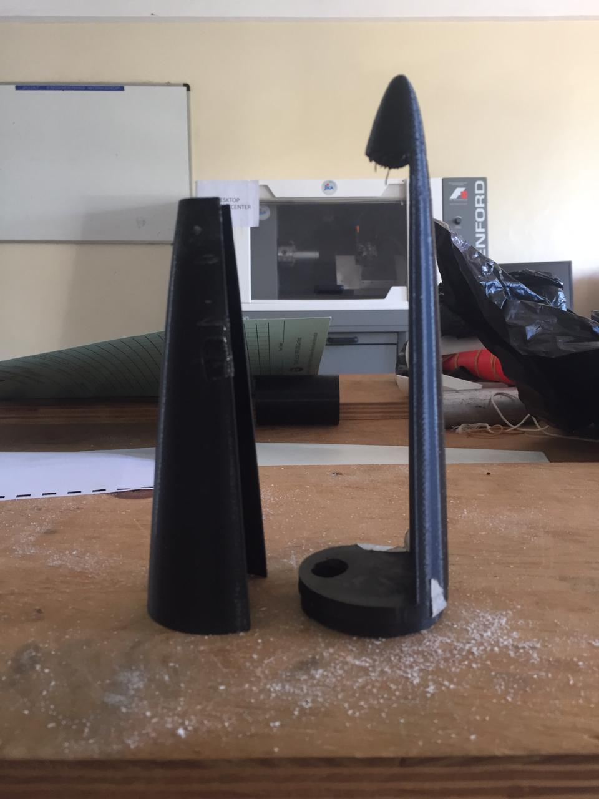
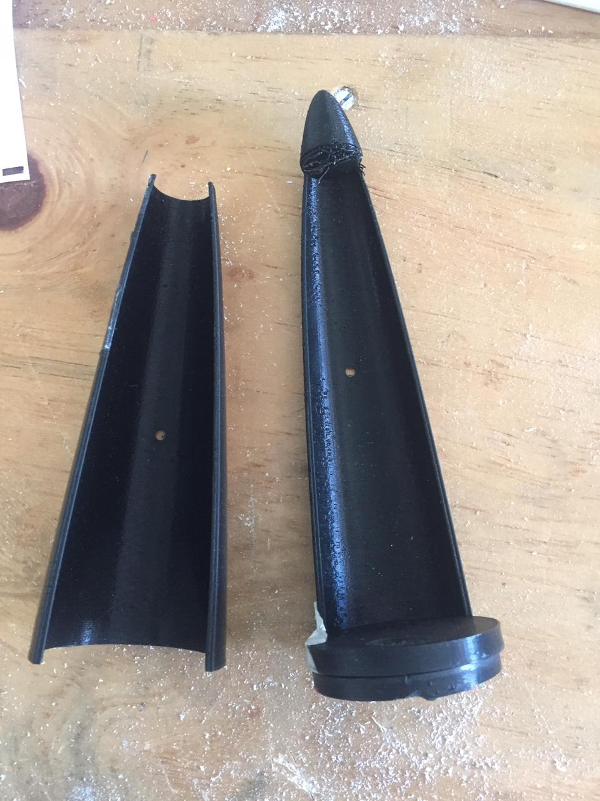

# Version 3.1

## Introduction

This was our third nose cone design for the rocket. We tried and redesign the latch mechanism so that the servo arm could push the cover outside rather that the servo arm holding the cover inside before launch. The design can be found [here](https://github.com/nakujaproject/airframev1/tree/cf36e4de9e948d365fbf606aeacae3a5e0503ae5)

### Some images

<!-- blank line -->
<figure class="video_container">
  <video controls="true" allowfullscreen="true">
    <source src="../parachuteImages/v3.1.mp4" type="video/mp4"></source>
  </video>
</figure>
<!-- blank line -->

## Problem

The servo arm was able to push the cover of the nose cone outside but the parachute still had trouble in deploying

## Modifications

We tried and make the opposite. So that the base part that joins with the rocket has less material while the cover covers all of it.
