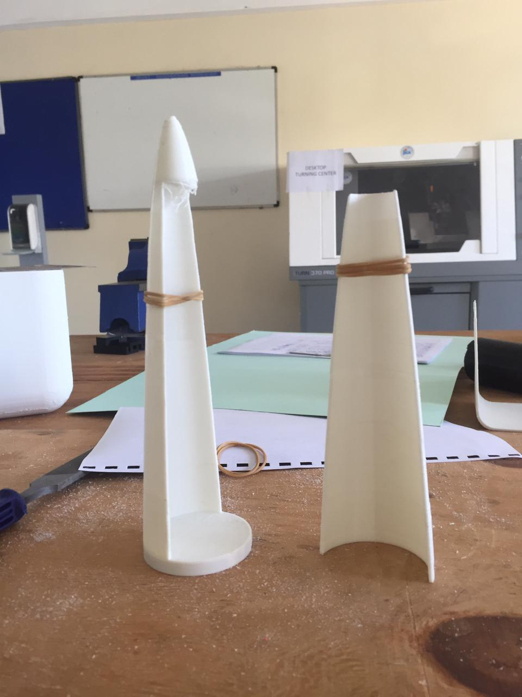

# Version 1.1

## Introduction

On this nose cone design we tried and have to change the dimensions rather than having it half-and-half so that the base part could cover half and also the cover to cover half, we had the base part to be at 70% and the top part at 30% of the coverage. We then added the spring mechanism to the base part this was to create an outward force to push the parachute out. The design can be found [here](https://github.com/nakujaproject/airframev1/tree/601282b1a38ceb6b29486d730ce19b3bf3055e32)

### Some images

<!-- blank line -->
<figure class="video_container">
  <video controls="true" allowfullscreen="true">
    <source src="../parachuteImages/v4.1.mp4" type="video/mp4"></source>
  </video>
</figure>
<!-- blank line -->

## Problem

We didn't find a mechanism to hold the top part to the base part. So the cover was not holding the parachute in and could fly off any time possible.

## Modifications

We inserted a pin on the top part need the nose. This is to hold the nose part while the servo pushes it in from the bottom.