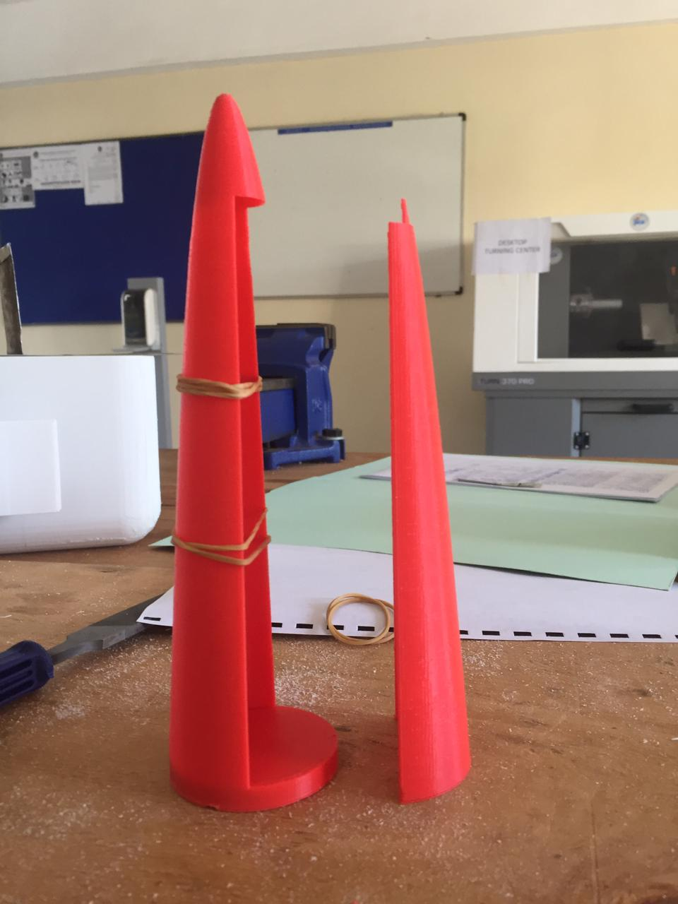

# Version 1.1

## Introduction

On this nose cone design we inserted a pin on the top part need the nose. This is to hold the nose part while the servo pushes it in from the bottom. We then added the spring mechanism to the base part this was to create an outward force to push the parachute out. This was done while maintaining the previous specs. The design can be found [here](https://github.com/nakujaproject/airframev1/tree/8eca6001235c1c59b9d69e9f7931666770087936)

### Some images

## Problem

No problem so far awaiting testing

## Modifications
